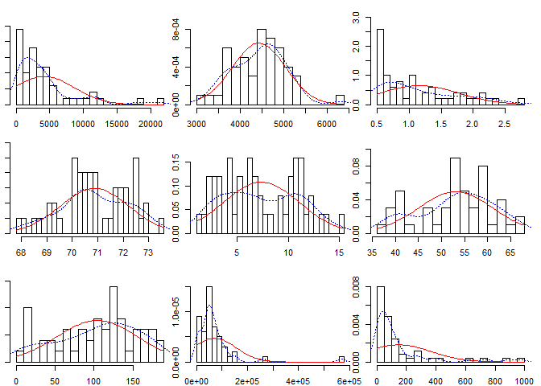
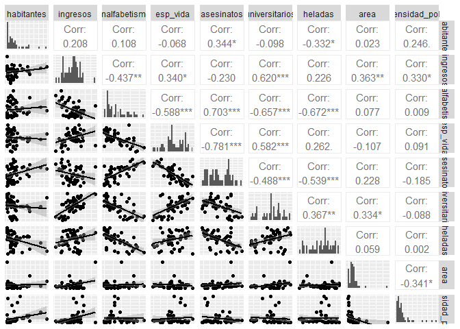
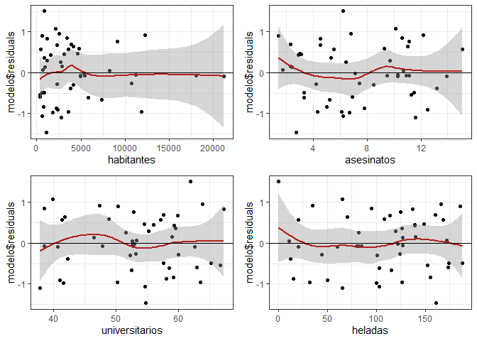
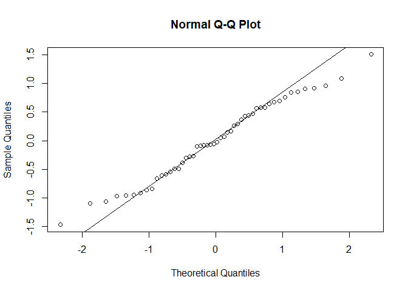
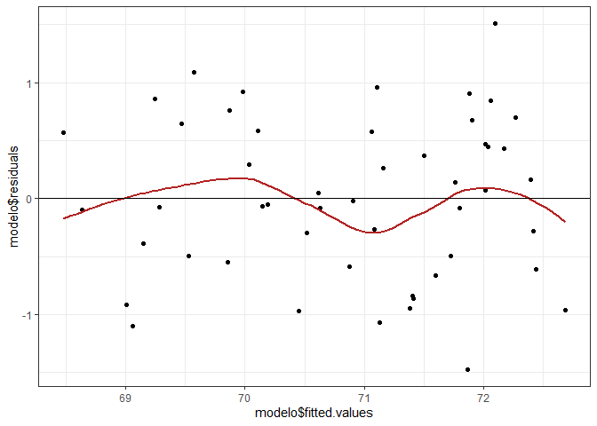
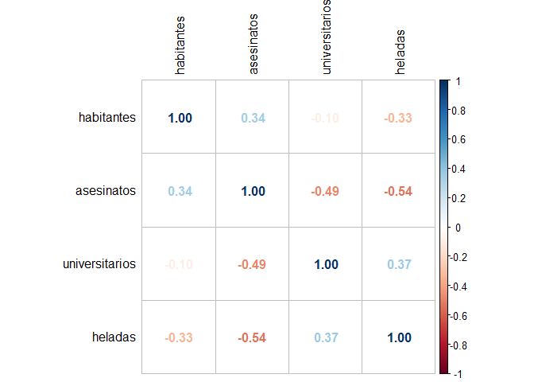
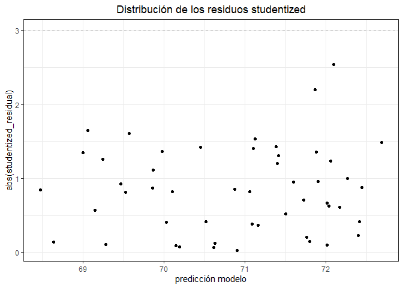
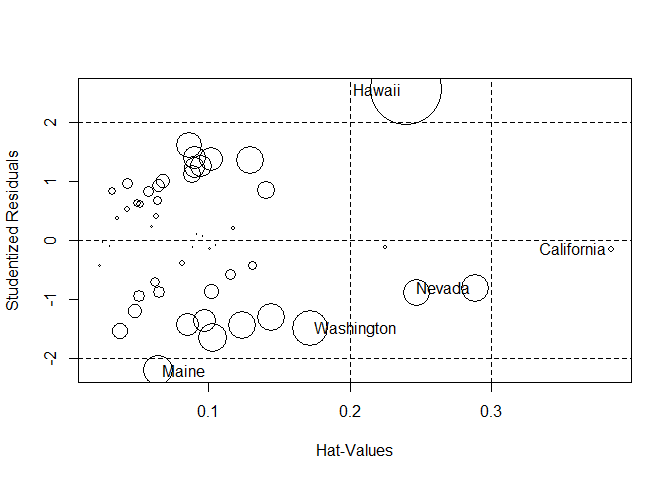

# Regresión Lineal Multiple

*Coeficiente de determinación:* explica que tan bueno es el modelo para
predecir; técnicamente es el porcentaje de varianza de *Y* con respecto
a la varianza del modelo.

Existen diferentes formas de seleccionar parámetros, el que se incluye
en R y esta basado en un modelo matemático es el método paso a paso o
stepwise.

## Ejemplo 1

### Problema

Un estudio quiere generar un modelo que permita predecir la esperanza de
vida media de los habitantes de una ciudad en función de diferentes
variables. Se dispone de información sobre: habitantes, analfabetismo,
ingresos, esperanza de vida, asesinatos, universitarios, heladas, área y
densidad poblacional.

Primero se cargan los datos y se renombran para las columnas dado que
tiene nombres en ingles:

``` r
library(dplyr)
```

    ## 
    ## Attaching package: 'dplyr'

    ## The following objects are masked from 'package:stats':
    ## 
    ##     filter, lag

    ## The following objects are masked from 'package:base':
    ## 
    ##     intersect, setdiff, setequal, union

``` r
datos <- as.data.frame(state.x77)
datos <- rename(habitantes = Population, analfabetismo = Illiteracy,
                ingresos = Income, esp_vida = `Life Exp`, asesinatos = Murder,
                universitarios = `HS Grad`, heladas = Frost, area = Area,
                .data = datos)
datos <- mutate(.data = datos, densidad_pobl = habitantes * 1000 / area)
```

Analisis de la relación entre las variables.

``` r
round(cor(x = datos, method = "pearson"), 3)
```

    ##                habitantes ingresos analfabetismo esp_vida asesinatos
    ## habitantes          1.000    0.208         0.108   -0.068      0.344
    ## ingresos            0.208    1.000        -0.437    0.340     -0.230
    ## analfabetismo       0.108   -0.437         1.000   -0.588      0.703
    ## esp_vida           -0.068    0.340        -0.588    1.000     -0.781
    ## asesinatos          0.344   -0.230         0.703   -0.781      1.000
    ## universitarios     -0.098    0.620        -0.657    0.582     -0.488
    ## heladas            -0.332    0.226        -0.672    0.262     -0.539
    ## area                0.023    0.363         0.077   -0.107      0.228
    ## densidad_pobl       0.246    0.330         0.009    0.091     -0.185
    ##                universitarios heladas   area densidad_pobl
    ## habitantes             -0.098  -0.332  0.023         0.246
    ## ingresos                0.620   0.226  0.363         0.330
    ## analfabetismo          -0.657  -0.672  0.077         0.009
    ## esp_vida                0.582   0.262 -0.107         0.091
    ## asesinatos             -0.488  -0.539  0.228        -0.185
    ## universitarios          1.000   0.367  0.334        -0.088
    ## heladas                 0.367   1.000  0.059         0.002
    ## area                    0.334   0.059  1.000        -0.341
    ## densidad_pobl          -0.088   0.002 -0.341         1.000

El anterior código muestra una tabla de correlación entre cada variable,
aún con una correlación positiva o negativa no se puede decir que las
variables estan correlacionadas porque primero se debe evaluar la
significancia estadística de esta relacion (p-value).

Para visualizar de mejor manera lo anterior se puede graficar las
sigueintes 2 figuras:

``` r
library(psych)
multi.hist(x = datos, dcol = c("blue", "red"), dlty = c("dotted", "solid"),
           main = "")
```



``` r
library(GGally)
```

    ## Loading required package: ggplot2

    ## 
    ## Attaching package: 'ggplot2'

    ## The following objects are masked from 'package:psych':
    ## 
    ##     %+%, alpha

    ## Registered S3 method overwritten by 'GGally':
    ##   method from   
    ##   +.gg   ggplot2

``` r
ggpairs(datos, lower = list(continuous = "smooth"),
        diag = list(continuous = "barDiag"), axisLabels = "none")
```

    ## `stat_bin()` using `bins = 30`. Pick better value with `binwidth`.

    ## `stat_bin()` using `bins = 30`. Pick better value with `binwidth`.
    ## `stat_bin()` using `bins = 30`. Pick better value with `binwidth`.
    ## `stat_bin()` using `bins = 30`. Pick better value with `binwidth`.
    ## `stat_bin()` using `bins = 30`. Pick better value with `binwidth`.
    ## `stat_bin()` using `bins = 30`. Pick better value with `binwidth`.
    ## `stat_bin()` using `bins = 30`. Pick better value with `binwidth`.
    ## `stat_bin()` using `bins = 30`. Pick better value with `binwidth`.
    ## `stat_bin()` using `bins = 30`. Pick better value with `binwidth`.


A simple vista se observa que para la esperanza de vida (Y) las
variables que más correlación tienen con esta (las que más son causa de)
son los asesinatos, analfabetismo y universitarios.

Ahora bien, se crea el modelo de regresión lineal considerando todas las
variables para predecir la experanza de vida:

``` r
modelo <- lm(esp_vida ~ habitantes + ingresos + analfabetismo + asesinatos +
               universitarios + heladas + area + densidad_pobl, data = datos )
summary(modelo)
```

    ## 
    ## Call:
    ## lm(formula = esp_vida ~ habitantes + ingresos + analfabetismo + 
    ##     asesinatos + universitarios + heladas + area + densidad_pobl, 
    ##     data = datos)
    ## 
    ## Residuals:
    ##      Min       1Q   Median       3Q      Max 
    ## -1.47514 -0.45887 -0.06352  0.59362  1.21823 
    ## 
    ## Coefficients:
    ##                  Estimate Std. Error t value Pr(>|t|)    
    ## (Intercept)     6.995e+01  1.843e+00  37.956  < 2e-16 ***
    ## habitantes      6.480e-05  3.001e-05   2.159   0.0367 *  
    ## ingresos        2.701e-04  3.087e-04   0.875   0.3867    
    ## analfabetismo   3.029e-01  4.024e-01   0.753   0.4559    
    ## asesinatos     -3.286e-01  4.941e-02  -6.652 5.12e-08 ***
    ## universitarios  4.291e-02  2.332e-02   1.840   0.0730 .  
    ## heladas        -4.580e-03  3.189e-03  -1.436   0.1585    
    ## area           -1.558e-06  1.914e-06  -0.814   0.4205    
    ## densidad_pobl  -1.105e-03  7.312e-04  -1.511   0.1385    
    ## ---
    ## Signif. codes:  0 '***' 0.001 '**' 0.01 '*' 0.05 '.' 0.1 ' ' 1
    ## 
    ## Residual standard error: 0.7337 on 41 degrees of freedom
    ## Multiple R-squared:  0.7501, Adjusted R-squared:  0.7013 
    ## F-statistic: 15.38 on 8 and 41 DF,  p-value: 3.787e-10

Se imprimen los datos y los valores t-value de cada variable, donde
algunas no parecen tener mucha correlación, aún así la significancia
estadística del modelo (p-value) es relevante 0.003787.

El modelo que se acaba de generar cuenta con variables que en realidad
no ayudan mucho a explicar la esperanza de vida, lo que busca es
deshacernos de ella, pero para ello hay que establecer una metodología
para saber que parámetros no son relevantes, aquí se emplea el método
paso a paso:

``` r
step(object = modelo, direction = "both", trace = 1)
```

    ## Start:  AIC=-22.89
    ## esp_vida ~ habitantes + ingresos + analfabetismo + asesinatos + 
    ##     universitarios + heladas + area + densidad_pobl
    ## 
    ##                  Df Sum of Sq    RSS     AIC
    ## - analfabetismo   1    0.3050 22.373 -24.208
    ## - area            1    0.3564 22.425 -24.093
    ## - ingresos        1    0.4120 22.480 -23.969
    ## <none>                        22.068 -22.894
    ## - heladas         1    1.1102 23.178 -22.440
    ## - densidad_pobl   1    1.2288 23.297 -22.185
    ## - universitarios  1    1.8225 23.891 -20.926
    ## - habitantes      1    2.5095 24.578 -19.509
    ## - asesinatos      1   23.8173 45.886  11.707
    ## 
    ## Step:  AIC=-24.21
    ## esp_vida ~ habitantes + ingresos + asesinatos + universitarios + 
    ##     heladas + area + densidad_pobl
    ## 
    ##                  Df Sum of Sq    RSS     AIC
    ## - area            1    0.1427 22.516 -25.890
    ## - ingresos        1    0.2316 22.605 -25.693
    ## <none>                        22.373 -24.208
    ## - densidad_pobl   1    0.9286 23.302 -24.174
    ## - universitarios  1    1.5218 23.895 -22.918
    ## + analfabetismo   1    0.3050 22.068 -22.894
    ## - habitantes      1    2.2047 24.578 -21.509
    ## - heladas         1    3.1324 25.506 -19.656
    ## - asesinatos      1   26.7071 49.080  13.072
    ## 
    ## Step:  AIC=-25.89
    ## esp_vida ~ habitantes + ingresos + asesinatos + universitarios + 
    ##     heladas + densidad_pobl
    ## 
    ##                  Df Sum of Sq    RSS     AIC
    ## - ingresos        1     0.132 22.648 -27.598
    ## - densidad_pobl   1     0.786 23.302 -26.174
    ## <none>                        22.516 -25.890
    ## - universitarios  1     1.424 23.940 -24.824
    ## + area            1     0.143 22.373 -24.208
    ## + analfabetismo   1     0.091 22.425 -24.093
    ## - habitantes      1     2.332 24.848 -22.962
    ## - heladas         1     3.304 25.820 -21.043
    ## - asesinatos      1    32.779 55.295  17.033
    ## 
    ## Step:  AIC=-27.6
    ## esp_vida ~ habitantes + asesinatos + universitarios + heladas + 
    ##     densidad_pobl
    ## 
    ##                  Df Sum of Sq    RSS     AIC
    ## - densidad_pobl   1     0.660 23.308 -28.161
    ## <none>                        22.648 -27.598
    ## + ingresos        1     0.132 22.516 -25.890
    ## + analfabetismo   1     0.061 22.587 -25.732
    ## + area            1     0.043 22.605 -25.693
    ## - habitantes      1     2.659 25.307 -24.046
    ## - heladas         1     3.179 25.827 -23.030
    ## - universitarios  1     3.966 26.614 -21.529
    ## - asesinatos      1    33.626 56.274  15.910
    ## 
    ## Step:  AIC=-28.16
    ## esp_vida ~ habitantes + asesinatos + universitarios + heladas
    ## 
    ##                  Df Sum of Sq    RSS     AIC
    ## <none>                        23.308 -28.161
    ## + densidad_pobl   1     0.660 22.648 -27.598
    ## + ingresos        1     0.006 23.302 -26.174
    ## + analfabetismo   1     0.004 23.304 -26.170
    ## + area            1     0.001 23.307 -26.163
    ## - habitantes      1     2.064 25.372 -25.920
    ## - heladas         1     3.122 26.430 -23.877
    ## - universitarios  1     5.112 28.420 -20.246
    ## - asesinatos      1    34.816 58.124  15.528

    ## 
    ## Call:
    ## lm(formula = esp_vida ~ habitantes + asesinatos + universitarios + 
    ##     heladas, data = datos)
    ## 
    ## Coefficients:
    ##    (Intercept)      habitantes      asesinatos  universitarios         heladas  
    ##      7.103e+01       5.014e-05      -3.001e-01       4.658e-02      -5.943e-03

Lo que hizó el código es evaluar el modelo dando pasos hasta llegar al
modelo siguiente que es el que se considera más ideal para expresar la
esperanza de vida:

``` r
modelo <- (lm(formula = esp_vida ~ habitantes + asesinatos + universitarios +
              heladas, data = datos))
summary(modelo)
```

    ## 
    ## Call:
    ## lm(formula = esp_vida ~ habitantes + asesinatos + universitarios + 
    ##     heladas, data = datos)
    ## 
    ## Residuals:
    ##      Min       1Q   Median       3Q      Max 
    ## -1.47095 -0.53464 -0.03701  0.57621  1.50683 
    ## 
    ## Coefficients:
    ##                  Estimate Std. Error t value Pr(>|t|)    
    ## (Intercept)     7.103e+01  9.529e-01  74.542  < 2e-16 ***
    ## habitantes      5.014e-05  2.512e-05   1.996  0.05201 .  
    ## asesinatos     -3.001e-01  3.661e-02  -8.199 1.77e-10 ***
    ## universitarios  4.658e-02  1.483e-02   3.142  0.00297 ** 
    ## heladas        -5.943e-03  2.421e-03  -2.455  0.01802 *  
    ## ---
    ## Signif. codes:  0 '***' 0.001 '**' 0.01 '*' 0.05 '.' 0.1 ' ' 1
    ## 
    ## Residual standard error: 0.7197 on 45 degrees of freedom
    ## Multiple R-squared:  0.736,  Adjusted R-squared:  0.7126 
    ## F-statistic: 31.37 on 4 and 45 DF,  p-value: 1.696e-12

Al comparar este método con el visual que se realizó arriba con las
gráficas se observa que las 3 variables que se mencionaron eran
representativas aquí se incluyen, con la diferencia de que aquí se
incluye una variable más.

El intervalo de confianza muestra donde se encuentran los datos
probablemente:

``` r
confint(lm(formula = esp_vida ~ habitantes + asesinatos + universitarios +
            heladas, data = datos))
```

    ##                        2.5 %        97.5 %
    ## (Intercept)     6.910798e+01 72.9462729104
    ## habitantes     -4.543308e-07  0.0001007343
    ## asesinatos     -3.738840e-01 -0.2264135705
    ## universitarios  1.671901e-02  0.0764454870
    ## heladas        -1.081918e-02 -0.0010673977

Aquí se observa un intervalo bastante cerrado, lo cual es bueno.

Ahora bien, es necesario evaluar que los predictores (variables
independientes) de verdad estan tienen una relación lineal con la
variable respuesta (esperanza de vida), para ello se grafican los
residuos de cada variable independiente:

``` r
library(ggplot2)
library(gridExtra)
```

    ## 
    ## Attaching package: 'gridExtra'

    ## The following object is masked from 'package:dplyr':
    ## 
    ##     combine

``` r
plot1 <- ggplot(data = datos, aes(habitantes, modelo$residuals)) +
    geom_point() + geom_smooth(color = "firebrick") + geom_hline(yintercept = 0) +
    theme_bw()
plot2 <- ggplot(data = datos, aes(asesinatos, modelo$residuals)) +
    geom_point() + geom_smooth(color = "firebrick") + geom_hline(yintercept = 0) +
    theme_bw()
plot3 <- ggplot(data = datos, aes(universitarios, modelo$residuals)) +
    geom_point() + geom_smooth(color = "firebrick") + geom_hline(yintercept = 0) +
    theme_bw()
plot4 <- ggplot(data = datos, aes(heladas, modelo$residuals)) +
    geom_point() + geom_smooth(color = "firebrick") + geom_hline(yintercept = 0) +
    theme_bw()
grid.arrange(plot1, plot2, plot3, plot4)
```

    ## `geom_smooth()` using method = 'loess' and formula 'y ~ x'

    ## `geom_smooth()` using method = 'loess' and formula 'y ~ x'
    ## `geom_smooth()` using method = 'loess' and formula 'y ~ x'
    ## `geom_smooth()` using method = 'loess' and formula 'y ~ x'


Como se observam todos los predictores cuentan con lineadlidad a lo
largo de 0.

Otros test para evaluar la linealidad del modelo son el método gráfico
de QQline y el test de Shapiro:

``` r
qqnorm(modelo$residuals)
qqline(modelo$residuals)
```


La imagen muestra linealidad entre los cuantiles teóricos y testeo.

``` r
shapiro.test(modelo$residuals)
```

    ## 
    ##  Shapiro-Wilk normality test
    ## 
    ## data:  modelo$residuals
    ## W = 0.97935, p-value = 0.525

Se observa que l p-value es 0.525, por lo que el modelo es valido para
linealidad.

Para evaluar la homocedasticidad se puede emplear la siguiente gráfica
de residuos:

``` r
ggplot(data = datos, aes(modelo$fitted.values, modelo$residuals)) +
geom_point() +
geom_smooth(color = "firebrick", se = FALSE) +
geom_hline(yintercept = 0) +
theme_bw()
```

    ## `geom_smooth()` using method = 'loess' and formula 'y ~ x'


Igualmente se puede emplear el método de test:

``` r
library(lmtest)
```

    ## Loading required package: zoo

    ## 
    ## Attaching package: 'zoo'

    ## The following objects are masked from 'package:base':
    ## 
    ##     as.Date, as.Date.numeric

``` r
bptest(modelo)
```

    ## 
    ##  studentized Breusch-Pagan test
    ## 
    ## data:  modelo
    ## BP = 6.2721, df = 4, p-value = 0.1797

Lo cual indica que existe homocedasticidad.

Por otra parte, para evaluar la correlación entre los predictores (si
hay correlación es malo) se puede emplear la siguiente gráfica:

``` r
library(corrplot)
```

    ## corrplot 0.88 loaded

``` r
corrplot(cor(dplyr::select(datos, habitantes, asesinatos,universitarios,heladas)),
         method = "number", tl.col = "black")
```


Se observa que la correlación es negativa en la mayoria de los casos,
aunque lijeramente positiva en otros casos, aunque no es una correlación
elevada.

``` r
library(car)
```

    ## Loading required package: carData

    ## 
    ## Attaching package: 'car'

    ## The following object is masked from 'package:psych':
    ## 
    ##     logit

    ## The following object is masked from 'package:dplyr':
    ## 
    ##     recode

``` r
vif(modelo)
```

    ##     habitantes     asesinatos universitarios        heladas 
    ##       1.189835       1.727844       1.356791       1.498077

En el test de inflación de varianza tampoco se observan datos relevantes
de inflación de varianza.

Evaluando si existe autocorrelación:

``` r
library(car)
dwt(modelo, alternative = "two.sided")
```

    ##  lag Autocorrelation D-W Statistic p-value
    ##    1      0.02867262      1.913997    0.75
    ##  Alternative hypothesis: rho != 0

Se observa que no hay evidenia de ello ya que el p-value es de 0.8

Observando si es que existen valores atípicos:

``` r
library(dplyr)
datos$studentized_residual <- rstudent(modelo)
ggplot(data = datos, aes(x = predict(modelo), y = abs(studentized_residual))) +
geom_hline(yintercept = 3, color = "grey", linetype = "dashed") +
geom_point(aes(color = ifelse(abs(studentized_residual) > 3, 'red', 'black'))) +
scale_color_identity() +
labs(title = "Distribución de los residuos studentized",
     x = "predicción modelo") + 
theme_bw() + theme(plot.title = element_text(hjust = 0.5))
```


Se observa que ningún dato es mayor a 3, lo que indica que no hay
observaciones atípicas, esto se puede comprobar corriendo el siguiente
código:

``` r
which(abs(datos$studentized_residual) > 3)
```

    ## integer(0)

Para evaluar si existe influencia entre las variables se puede emplear
el siguiente resumen de un modelo de influencia:

``` r
summary(influence.measures(modelo))
```

    ## Potentially influential observations of
    ##   lm(formula = esp_vida ~ habitantes + asesinatos + universitarios +      heladas, data = datos) :
    ## 
    ##            dfb.1_ dfb.hbtn dfb.assn dfb.unvr dfb.hlds dffit   cov.r   cook.d
    ## Alaska      0.41   0.18    -0.40    -0.35    -0.16    -0.50    1.36_*  0.05 
    ## California  0.04  -0.09     0.00    -0.04     0.03    -0.12    1.81_*  0.00 
    ## Hawaii     -0.03  -0.57    -0.28     0.66    -1.24_*   1.43_*  0.74    0.36 
    ## Nevada      0.40   0.14    -0.42    -0.29    -0.28    -0.52    1.46_*  0.05 
    ## New York    0.01  -0.06     0.00     0.00    -0.01    -0.07    1.44_*  0.00 
    ##            hat    
    ## Alaska      0.25  
    ## California  0.38_*
    ## Hawaii      0.24  
    ## Nevada      0.29  
    ## New York    0.23

Lo que muestra es la influencia según diferentes metologías, para
visualizar esto:

``` r
influencePlot(modelo)
```



    ##               StudRes        Hat       CookD
    ## California -0.1500614 0.38475924 0.002879053
    ## Hawaii      2.5430162 0.23979244 0.363778638
    ## Maine      -2.2012995 0.06424817 0.061301962
    ## Nevada     -0.8120831 0.28860921 0.053917754
    ## Washington -1.4895722 0.17168830 0.089555784

Aquí se observa que hay valors relevantes como el de California y
Hawaii.

## Ejemplo 2

### Problema

Se dispone de un dataset que contiene información de 30 libros. Se
conoce del peso total de cada libro, el volumen que tiene y el tipo de
tapas (duras o blandas). Se quiere generar un modelo lineal múltiple que
permita predecir el peso de un libro en función de su volumen y del tipo
de tapas.

Nuevamente, primero se deben de crear o extraer los datos, en este caso
se crean:

``` r
datos <- data.frame(peso = c(800, 950, 1050, 350, 750, 600, 1075, 250, 700,
                             650, 975, 350, 950, 425, 725),
                    volumen = c(885, 1016, 1125, 239, 701, 641, 1228, 412, 953,
                                929, 1492, 419, 1010, 595, 1034),
                    tipo_tapas = c("duras", "duras", "duras", "duras", "duras", 
                                   "duras", "duras", "blandas", "blandas",
                                   "blandas", "blandas", "blandas", "blandas",
                                   "blandas", "blandas"))
head(datos, 4)
```

    ##   peso volumen tipo_tapas
    ## 1  800     885      duras
    ## 2  950    1016      duras
    ## 3 1050    1125      duras
    ## 4  350     239      duras
